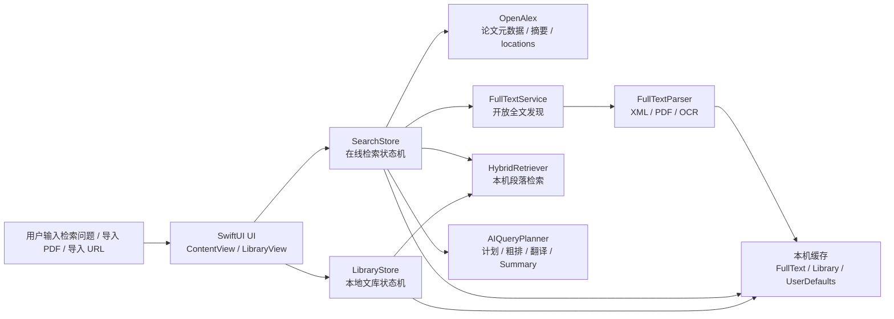

# RagBio App Logic

本文档面向软件工程同事，说明 RagBio 当前实现背后的主要逻辑、数据流、模块职责和关键取舍。它不是用户手册，而是用于快速理解代码结构和系统行为的工程说明。

当前实现日期：2026-07-09。

## 1. 产品定位

RagBio 是一个原生 macOS 学术证据检索应用，目标不是让大模型直接“回答论文事实”，而是把论文发现、全文读取、段落定位、结构化摘要和本地文库串起来。

核心目标：

- 从 OpenAlex 检索论文元数据和摘要。
- 尽可能读取合法开放全文，保留章节、段落、页码等可追溯信息。
- 对全文段落做本地检索和证据定位。
- 对能读取全文的论文生成 literature review 可用的结构化英文摘要。
- 对没有全文的论文明确降级为摘要级证据。
- 支持用户导入自己的 PDF，形成本地检索文库。
- 支持 AI 搜索，但不把模型记忆当成论文事实。

RagBio 不绕过付费墙，也不保存出版社账号密码。受限论文需要用户在浏览器或机构系统中自行下载有权访问的 PDF，再导入应用。

## 2. 技术栈和入口

RagBio 是 SwiftPM macOS App。

主要入口：

- `Sources/RagBio/RagBioApp.swift`：SwiftUI App 入口和窗口设置。
- `Sources/RagBio/ContentView.swift`：主界面、搜索栏、列表、详情页、设置页。
- `Sources/RagBio/SearchStore.swift`：在线检索、AI 搜索、全文读取、精排、翻译、报告导出的主要状态机。
- `Sources/RagBio/LibraryStore.swift`：本地文库 UI 状态和本地检索逻辑。
- `Sources/RagBio/LibraryService.swift`：本地文库持久化、PDF 导入、收藏、URL 引用。

构建入口：

```bash
swift build
./scripts/build-app.sh
```

## 2.1 高层数据流

RagBio 的核心设计可以概括为：外部服务只负责“发现论文和取得合法内容”，本机负责“解析、缓存、检索和证据边界”，大模型只在用户明确启用时参与“理解、排序、翻译和结构化摘要”。



工程上最重要的边界：

- `SearchStore` 管在线检索和 AI 搜索，不直接持久化本地文库。
- `LibraryStore` 管“我的文库”，只检索用户保存的 PDF、在线收藏和 URL 引用。
- `FullTextService` 只负责找到并解析合法全文；找不到全文时最多返回摘要 fallback。
- `HybridRetriever` 是纯本机检索，不调用外部模型。
- `AIQueryPlanner` 不直接访问 OpenAlex，也不直接改 UI；它只返回结构化 JSON。
- `CredentialStore` 只负责本机保存和读取 key，不负责验证；验证在 `CredentialValidator`。

## 2.2 模块职责表

| 模块 | 主要职责 | 不负责什么 |
| --- | --- | --- |
| `ContentView.swift` | 在线检索 UI、详情页、设置页、翻译/收藏/读取全文入口 | 不直接解析全文，不直接写文库文件 |
| `SearchStore.swift` | 在线搜索状态机、AI 搜索流程、全文读取触发、证据等级、summary 状态 | 不保存 PDF 文库 catalog |
| `OpenAlexClient.swift` | OpenAlex works API 请求、重试、短期内存缓存 | 不做 AI 排序，不判断全文可信度 |
| `AIQueryPlanner.swift` | AI search plan、AI 摘要粗排、翻译、全文 summary JSON 生成 | 不直接联网检索论文数据库 |
| `FullTextService.swift` | Europe PMC、OpenAlex TEI/PDF、Unpaywall、Semantic Scholar、开放 PDF、摘要 fallback | 不绕过付费墙 |
| `FullTextParser.swift` | XML/PDF/OCR 解析为段落结构 | 不判断论文是否相关 |
| `HybridRetriever.swift` | 本机段落检索和混合打分 | 不调用大模型 |
| `LibraryStore.swift` | 我的文库 UI 状态、PDF/URL 导入、文库检索、URL 导出 | 不处理在线 AI 搜索 |
| `LibraryService.swift` | 本地文库 catalog、文件复制、PDF 索引、收藏和 URL 引用持久化 | 不访问 OpenAlex |
| `CredentialStore.swift` | API Key 本机存取和运行时缓存 | 不测试 key 是否可用 |
| `CredentialValidator.swift` | API Key / endpoint 可用性测试 | 不保存 key |
| `ScanModels.swift` | research scan 决策、Evidence Table、Field Scan Report 的 Codable 模型 | 不做 UI、不调用大模型 |
| `EvidenceTableService.swift` | 从当前排序、扫描决策、摘要和已读全文 summary 生成 deterministic Evidence Table | 不调用大模型 |
| `FieldScanService.swift` | 从 Evidence Table 生成并校验 Field Scan Report | 不直接读取 Work 列表，不允许无来源 claim |
| `OnlineSearchProjectStore.swift` | 命名 research project 的 index、project JSON 读写、重命名、复制、删除 | 不保存 API Key、不保存 raw full-text body |

## 3. 核心数据模型

主要模型在 `Sources/RagBio/Models.swift`。

### Work

`Work` 是 OpenAlex 论文对象在应用里的表示，包含：

- OpenAlex ID
- DOI / PMID / PMCID
- title
- publication date / year
- cited count
- authors
- venue
- abstract inverted index 还原后的摘要
- open access 信息
- content URLs
- locations / PDF URLs
- has full text 标记

注意：标题、作者、年份、引用数、摘要等在线元数据来自 OpenAlex。RagBio 不自己编造论文元数据。

### FullTextDocument

`FullTextDocument` 是全文或摘要被解析后的统一结构：

- `workID`
- `title`
- `source`
- `sourceURL`
- `paragraphs`
- `loadedAt`

其中 `paragraphs` 是 `FullTextParagraph` 数组，每个段落保留：

- `section`
- `text`
- `ordinal`
- `page`

### FullTextSource

全文来源包括：

- `europePMC`
- `openAlexTEI`
- `openAlexPDF`
- `unpaywallPDF`
- `publisherPDF`
- `localGROBID`
- `importedPDF`
- `abstract`

关键规则：

```swift
source.isFullText == true
```

只有非 `abstract` 的来源才算全文。OpenAlex 摘要 fallback 不会被当成全文，也不会触发全文 literature review summary。

### LibraryItem

`LibraryItem` 表示本地文库条目，可以来自：

- 用户导入 PDF
- 在线论文收藏
- URL 引用

它保存标题、文件名、hash、添加时间、修改时间、标签、页数、词数、段落数、来源 URL、作者、期刊和年份。

## 4. 在线关键词搜索

关键词搜索是最直接的路径。

流程：

1. 用户输入关键词。
2. `SearchStore.search()` 判断当前模式为 `keyword`。
3. 清空 AI 相关状态。
4. 调用 `OpenAlexClient.search(...)`。
5. 取回一页结果，默认每页 20 篇。
6. 从 OpenAlex 摘要中抽取本页 evidence 句子。
7. 显示列表和详情页。

关键词搜索不会自动遍历远程全文来源。它只会显示 OpenAlex 返回的论文元数据和摘要。用户可以手动点击“读取全文”或“导入 PDF”。

OpenAlex 请求逻辑在 `Sources/RagBio/OpenAlexClient.swift`：

- endpoint：`https://api.openalex.org/works`
- 查询参数：`search`
- 排序：相关性、最新发表、引用数
- filter：默认排除撤稿 `is_retracted:false`
- 可选 filter：起始年份、开放获取
- select：只取应用需要的字段，减少 payload
- 支持 `api_key`
- 内存缓存 30 分钟，最多 100 条
- 429、5xx、网络中断和超时会重试

OpenAlex query 规范化在 `Sources/RagBio/OpenAlexQueryNormalizer.swift`：

- 关键词搜索和 AI 搜索都会在发给 OpenAlex 前经过这一层。
- 会移除 `AND`、`OR`、`NOT`、括号、引号和常见字段语法，例如 `title:`、`abstract:`。
- 会通过 `SynonymRule` 规则表做保守扩展，避免把所有同义词逻辑堆成不可维护的 if 分支。
- 当前规则覆盖四类高频检索语境：
  - MeSH-like / 疾病概念：例如 `ASD → autism spectrum disorder`、`IBD → inflammatory bowel disease / Crohn disease / ulcerative colitis`、`NSCLC → non-small cell lung cancer`。
  - 药物和治疗概念：例如 `NDC → National Drug Code / RxNorm / prescription claims`、`NSAID → ibuprofen / naproxen`、`PPI → omeprazole / pantoprazole`。
  - 医疗数据库和编码系统：例如 `EHR / EMR`、`FAERS / AERS`、`OMOP`、`ICD`、`CPT`、`MedDRA`。
  - 人群和性别词：例如 `children → pediatric`、`female / girls → sex differences / gender differences`。
- 会保留原始缩写，不用扩展词替换缩写，避免把用户原意抹掉。
- 对 `AD`、`PD` 这类高度歧义缩写不做自动扩展，避免把 `PD-1` 这类免疫治疗词误扩展成 Parkinson disease。
- query 会去重并限制长度，避免把过长 prompt 式文本直接塞进 OpenAlex `search`。

## 5. AI 搜索总体逻辑

AI 搜索不是让模型直接检索互联网。它分成几个阶段：

1. 大模型把自然语言问题转换成 `AISearchPlan`。
2. App 用 `AISearchPlan.search_query` 去 OpenAlex 获取候选论文。
3. 本地快速排序先显示临时候选，避免界面空白。
4. 大模型对前 25 篇候选做摘要级粗排。
5. App 对前 20 篇证据候选尝试读取全文。
6. 对读到全文的论文做本地段落检索和证据级重排。
7. 对读到全文的论文生成英文 literature review summary。
8. 用户翻页后，当前页还会后台尝试补全文和生成 summary。

当前 active path 里有一个有意的速度取舍：AI 只做 search plan、摘要级粗排和全文 summary；全文证据阶段主要使用本机检索和本机证据排序。原先未接入的“大模型 evidence rerank”死代码已经删除，避免维护者误以为全文补强还会额外调用第二轮模型重排。

当前关键参数在 `SearchStore.swift`：

```swift
pageSize = 20
aiCandidateLimit = 50
aiCandidatePageSize = 50
aiCoarseRankingBatchSize = 25
aiCoarseRankingLimit = 25
aiEvidenceCandidateLimit = 20
```

含义：

- OpenAlex 最多取 50 篇 AI 候选。
- 每页显示 20 篇。
- 大模型摘要粗排优先处理前 25 篇。
- 证据精排优先处理前 20 篇。
- 翻页后会对新显示页后台尝试补全文。

## 6. AI Search Plan

AI 搜索第一步由 `AIQueryPlanner.plan(...)` 生成 `AISearchPlan`。

结构：

```swift
struct AISearchPlan {
    let searchQuery: String
    let fromYear: Int?
    let openAccessOnly: Bool
    let sort: SearchSort
    let explanation: String
}
```

字段含义：

- `search_query`：英文 OpenAlex 普通搜索词。
- `from_year`：可选起始年份。
- `open_access_only`：是否只看开放获取。
- `sort`：相关性、最新发表、引用数。
- `explanation`：中文解释，告诉用户模型如何理解问题。

重要约束：

- `search_query` 不是数据库布尔查询。
- 模型被要求不要输出 `AND`、`OR`、`NOT`、括号、字段语法。
- 模型应输出 OpenAlex 普通搜索更适合的英文关键词。
- 对 `NDC` 这类缩写，App 会提示模型保留原缩写，不要乱扩展。
- 在药物、处方、claims、EHR、不良反应、药品编码语境中，`NDC` 优先理解为 `National Drug Code(s)`，同时保留 `NDC`。

超时策略：

- AI plan 最多等 6 秒。
- 如果大模型没有按时返回，App 直接提示失败。
- 当前实现不会再用本地规则伪造 AI 检索式。

这是刻意设计：宁愿告诉用户“大模型没返回”，也不要用关键词兜底结果冒充 AI 搜索结果。

## 7. AI 候选获取

AI plan 成功后，App 会检查 OpenAlex API Key。

当前 AI 候选检索要求 OpenAlex Key。没有 Key 时，AI 搜索直接失败并提示配置 OpenAlex。

候选获取逻辑：

1. 用规范化后的 `plan.searchQuery` 作为 OpenAlex `search` 参数。
2. 应用 `plan.sort`、`plan.fromYear`、`plan.openAccessOnly`。
3. `per-page = 50`。
4. 去重。
5. 最多保留 50 篇。

候选只是“可能相关”，不是最终排序。

## 8. 本地快速排序

拿到 OpenAlex 候选后，App 会先做本地快速排序并立即显示。

目的：

- 避免用户等待大模型粗排时界面一直空白。
- 给用户一个可见的首屏反馈。

输入：

- 用户原始问题
- AI search query
- 候选标题
- 摘要
- 期刊
- 是否有摘要
- 是否开放获取

逻辑：

- 标题命中 query token 加分较高。
- 摘要命中加分较低。
- 期刊命中少量加分。
- 有摘要加分。
- 开放获取加分。
- 初始顺序越靠前有基础分。

输出：

- `aiScores`
- `aiReasons`
- `aiEvidenceLevels = "临时候选"`

本地快速排序不是最终 AI 结果。它只是首屏兜底。

## 9. AI 摘要粗排

本地快速排序显示后，App 会在后台调用大模型对候选做摘要级粗排。

当前只优先处理前 25 篇：

```swift
aiCoarseRankingLimit = 25
aiCoarseRankingBatchSize = 25
```

输入给模型：

- 用户原始问题
- 论文标题
- 年份
- 期刊
- OpenAlex 摘要，截断后输入

模型输出：

- `score`：0 到 100
- `relevant`：是否相关
- `reason`：中文短句，概括为什么相关

粗排完成后：

- 相关论文排到前面。
- 其余候选仍保留在后面，避免漏掉潜在相关论文。
- UI 会显示“AI 已优先精排前 25 篇；其余候选仍保留在后面”。

如果 AI 粗排失败或超时：

- App 保留本地快速排序结果。
- UI 明确提示“AI 粗排未返回”或类似状态。
- 不把它当作最终 AI 排序。

## 10. 证据精排和全文段落精排

证据精排的目标是：优先让读到全文的论文获得更可靠的排序和 summary，而不是只靠标题摘要。

当前实现路径在 `SearchStore.rerankWithFullTextEvidence(...)`。

阶段一：无全文的初始证据排序

1. 取 AI ranked works 的前 20 篇。
2. 先构造没有全文段落的 evidence inputs。
3. 用本地 `fallbackEvidenceRanking(...)` 生成初始证据排序。
4. 立刻显示这批结果。

阶段二：全文补强

1. 对这 20 篇并发尝试读取全文。
2. 单篇全文读取软超时为 6 秒。
3. 只接受 `source.isFullText == true` 的文档。
4. 自动获取的全文还要通过标题匹配校验。
5. 成功读到全文后，写入 `aiFullTextDocuments`。
6. 对全文段落运行 `HybridRetriever.search(...)`，每篇取最相关 3 个段落。
7. 再用本地 `fallbackEvidenceRanking(...)` 更新排序和证据等级。
8. 对这些全文论文启动 literature review summary 生成。

关键点：

- 当前 active path 中，“证据精排”主要是本地逻辑，不是再次调用大模型做证据排序。
- 未接入的 `rankEvidenceInputs(...)` / `rankEvidenceInputsWithModel(...)` / `rankEvidenceBatch(...)` 已删除，避免死代码误导维护者。
- 这样做是为了控制速度和稳定性，避免全文阶段被大模型二次请求拖慢。

证据等级：

- `全文段落精排`：读到合法全文，并用全文段落参与本地证据排序。
- `仅摘要精排`：没有全文，只能用摘要参与排序。
- `全文已读取`：翻页后后台补全文成功，但不一定重新触发完整首屏精排。
- `临时候选`：OpenAlex 候选已展示，但 AI 粗排或证据阶段尚未完成。

## 11. 翻页后的后台补全文

AI 搜索列表不是只处理第一页。

每次 `showAIPage(...)` 显示当前页时，如果当前是 AI 模式，会调用：

```swift
enrichVisibleAIPageFullTextInBackground(...)
```

它会对当前页还没有全文的论文尝试后台读取全文。

逻辑：

- 只处理当前页可见的论文。
- 已有全文、正在生成 summary、正在读取全文的论文跳过。
- 单篇软超时 14 秒。
- 读到全文后存入 `aiFullTextDocuments`。
- 更新证据等级为 `全文已读取`。
- 启动 literature review summary 生成。
- 如果没有找到全文，记录到 `aiVisiblePageFullTextFailures`，详情页会显示说明。

因此，第一页一开始可能只有摘要；过一段时间或用户翻页后，部分论文会补出全文 summary。

## 12. 全文获取链路

全文读取逻辑在 `Sources/RagBio/FullTextService.swift`。

读取顺序：

1. 本地全文缓存。
2. Europe PMC XML。
3. OpenAlex TEI XML。
4. OpenAlex 返回的公开 PDF location。
5. Unpaywall PDF。
6. OpenAlex PDF。
7. Semantic Scholar PDF。
8. OpenAlex 摘要 fallback。

注意：

- 只有前 1 到 7 类成功时才算全文。
- 第 8 类摘要 fallback 只是为了让 UI 能显示 OpenAlex 摘要，不算全文。
- 全文读取会缓存到本机。
- 缓存只保存真正全文，不保存摘要 fallback。
- 网络层有 10 分钟的失败冷却：同一个全文来源 URL 近期失败后会被暂时跳过，避免翻页、后台补全文或重复搜索时持续阻塞同一失败来源。
- 冷却 key 会移除 `api_key` 和 `email` 参数，避免把凭据写进内存 key。
- 用户点击“重新读取”会清除全文缓存并重置失败冷却，允许手动再次尝试。

### Europe PMC

优先使用 PMCID。

如果没有 PMCID，则依次尝试：

- DOI 查询
- PMID 查询
- 标题 + 年份查询

找到 PMCID 后读取 Europe PMC XML，并解析为 `FullTextDocument`。

### OpenAlex TEI / PDF

OpenAlex `content_urls.grobid_xml` 和 `content_urls.pdf` 通常需要 API Key。

如果没有 Key，App 会记录“需要 API Key”错误，并继续尝试其他来源。

### PDF

PDF 来源包括：

- OpenAlex best OA location
- OpenAlex primary location
- OpenAlex all locations
- Unpaywall
- Semantic Scholar 返回的 PDF URL

PDF 会用 `PDFTextParser` 解析文本。扫描页可能触发 macOS Vision OCR。

### 用户导入 PDF

用户点击“导入 PDF”时，App 直接解析用户选择的文件，来源标记为 `importedPDF`。用户导入 PDF 会被信任为当前论文的全文，因为文件由用户主动选择。

## 13. 全文标题匹配校验

自动抓取的开放 PDF 有可能不是当前论文，或者是错误落地页。为避免把错误 PDF 当证据，App 做标题匹配校验。

规则：

- 自动全文必须和当前 `Work.title` 有足够关键词重合。
- 如果标题明显不匹配，则丢弃该全文。
- 如果错误全文已经进入缓存，会清理缓存。
- 不匹配的全文不会用于全文段落精排，也不会生成 literature review summary。

用户手动导入 PDF 不走这个严格校验，因为它是用户主动选择的文件。

## 14. 全文解析

解析逻辑在 `Sources/RagBio/FullTextParser.swift`。

### XML

`StructuredXMLParser` 解析 TEI/JATS 风格 XML。

它会尽量提取：

- body
- section heading
- paragraph
- page break

输出结构化段落，保留 section 和 page。

### PDF

`PDFTextParser` 基于 PDFKit 读取每页文本。

如果页面文本层不足，会尝试 macOS Vision OCR：

- English
- Simplified Chinese
- Traditional Chinese

PDF 文本会按页面和段落切分，并尽量保留页码。

PDF 清洗规则：

- 先收集每页行文本，再识别跨页重复出现的短行，作为可能的页眉/页脚过滤掉。
- 过滤纯页码、`Page x`、明显 URL/DOI 行、下载声明、版权声明等 boilerplate。
- 遇到独立的 `References`、`Bibliography`、`Literature Cited`、`Works Cited` 或 `参考文献` 标题后停止继续解析，避免参考文献列表污染检索和 summary。
- 连字符断行会尽量合并，例如 `thera-\npy` 会合并为 `therapy`。
- 这些规则是保守清洗，不会尝试重排复杂双栏版面。

## 15. 本地段落检索

段落检索逻辑在 `Sources/RagBio/HybridRetriever.swift`。

它是本地混合检索，不调用远程模型。

输入：

- query
- `FullTextParagraph` 数组
- limit

打分由两部分组成：

1. 词法相关性：token 命中、TF-IDF 类似分数、完整 query 命中、section 命中。
2. 语义相关性：macOS NaturalLanguage 的 English sentence embedding cosine similarity。

当前组合：

```swift
score = lexicalNormalized * 0.72 + semantic * 0.28
```

过滤：

- score 必须大于 0.08。
- 默认返回最高分段落。

用途：

- 全文定位 tab。
- 证据精排阶段取每篇最相关 3 个段落。
- 本地文库检索。
- 证据报告。

## 16. Literature Review Summary

用户最关心的结构化摘要是 `Literature Review Summary`。

### 单篇 Article Summary 的触发与时限

截图中的单篇 `Article Summary` 会在论文页面拿到全文后触发；它不是持久化的后台队列。App 将最多约 7,000 个字符的全文段落摘录发送给当前启用的 AI provider，并要求输出 Topic、Methods、Results、Key Metrics、Outlook 的英文结构化摘要。单次模型请求的超时为 35 秒：超时或 API 出错后会显示错误和 `Retry`，不会在 App 进入后台后保证继续运行。

论文详情页另有一个更长的系统综述导向 extraction note，只有在用户打开已读到全文的详情时才生成；它要求来源定位，单次模型请求超时为 45 秒。这个 note 同样不是持久化后台队列，也不会在下次启动时自动恢复。

生成条件：

- 必须有真正全文。
- `document.source.isFullText == true`。
- 摘要 fallback 不生成这个模块。

生成位置：

- AI 搜索全文补强成功时自动生成。
- 翻页后台补全文成功时自动生成。
- 用户点击“读取全文”成功时自动生成。
- 用户导入 PDF 成功时自动生成。

输出语言：

- 英文。

字段：

- Topic
- Methods
- Results
- Key Metrics
- Outlook

当前 AI prompt 要求：

- 只能使用传入的全文摘录。
- 不允许使用模型记忆。
- 不允许编造结果。
- 每个字段必须是完整、自洽的英文句子。
- 指标必须带标签和上下文，不能是裸数值。

示例要求：

```text
Sample size: 152,904 veterans
OIC prevalence: 12.6%
Search cutoff: July 2024
```

不允许：

```text
152,904
12.6%
98%
```

全文摘录选择逻辑在 `AIQueryPlanner.fullTextSummaryContext(...)`：

- 优先选择 section 中含有 abstract、summary、introduction、background、methods、participants、data、results、discussion、conclusion、limitations、future 的段落。
- 如果没有这些 section，就取前 16 个段落。
- 每段最多截取 900 字符。
- 总上下文最多约 7000 字符。

如果 AI summary 失败：

- App 会使用 `LiteratureReviewSummary.make(...)` 做本地兜底。
- 兜底摘要也只基于全文段落。
- 如果没有全文，不会生成全文 summary。

来源依据展示：

- Literature Review Summary 卡片会为 `Topic`、`Methods`、`Results`、`Key Metrics`、`Outlook` 分别显示对应的 `Source: <locator>`。
- 每个字段自己的 `Locate` 按钮会跳到支撑该字段的全文段落。
- Literature Review Summary 卡片还会显示 `Source passages used` 折叠区，集中列出这些字段级来源段落。
- 来源段落由 `LiteratureReviewCitationBuilder` 根据 summary 字段文本、段落 section、关键词重合和关键数值重合进行本地匹配。
- 每条来源段落都有 `Locate` 按钮；点击后会切到“全文定位”tab，将该段落置顶，并把定位查询设置为该段正文摘录。
- 这些来源段落来自已解析的 `FullTextDocument.paragraphs`，不会触发新的网络请求或新的大模型请求。
- 这一步的目的不是证明每个句子都逐字可追溯，而是让软件工程和研究用户能按字段快速检查 summary 是否确实来自正文。

## 17. OpenAlex 摘要和全文 summary 的区别

详情页可能出现两类内容：

### OpenAlex 摘要

来源：

- OpenAlex `abstract_inverted_index` 还原。

特点：

- 是论文数据库摘要。
- 不一定有 methods/results 的完整结构。
- 没有全文时也能显示。
- 不代表 RagBio 读取过正文。

### Literature Review Summary

来源：

- RagBio 已读取到的全文 XML 或 PDF。

特点：

- 只对全文生成。
- 英文结构化输出。
- 面向 literature review。
- 包含 Topic、Methods、Results、Key Metrics、Outlook。
- UI 右上角会标明 `Based on full text · <source>`。
- UI 会为每个字段提供来源段落 locator 和可展开的来源段落摘录，方便核对 summary 依据。

如果一篇论文只有 OpenAlex 摘要，UI 不应该显示 Literature Review Summary。

## 18. 摘要级论文简述

列表里的短句，例如“论文简述”或“摘要简述”，不是 literature review summary。

用途：

- 帮用户快速扫列表。
- 对没有全文的论文给一句话概括。

来源：

- AI 粗排返回的 `reason`。
- 或本地 `abstractOnlyPaperSummary(...)` 生成的简短中文说明。

限制：

- 它不能替代全文 summary。
- 它可能只基于标题和摘要。
- 不应用作最终 literature review 内容。

## 18.1 Research Scan、Evidence Table 和 Field Scan

Research Scan 是在线搜索结果上的临时整理层，用于把一次研究主题下的候选论文筛成可审查的表格和领域报告。

### Scan Decision

扫描决策模型在 `Sources/RagBio/ScanModels.swift`：

```swift
enum ScanDecision {
    case unreviewed
    case use
    case maybe
    case exclude
}
```

设计边界：

- `Use` / `Maybe` / `Exclude` 只属于当前在线检索 session。
- 它不是收藏；收藏仍然是全局文库保存动作。
- 新搜索会清空当前扫描决策、Evidence Table 和 Field Scan Report。
- 决策会通过 `OnlineSearchSessionStore` 随当前在线检索 session 保存和恢复。
- UI 在列表卡片和详情页都提供决策按钮。
- 左侧 filter 支持 `All / Use / Maybe / Exclude / Unreviewed`。

### Evidence Table

Evidence Table 由 `EvidenceTableService.make(...)` 生成，是 deterministic 工程产物，不调用大模型。

输入：

- 当前排序后的论文列表。
- 当前 `scanDecisions`。
- OpenAlex 元数据和摘要。
- AI 粗排分数、理由和证据等级。
- 当前已经读取到的全文 literature review summary。
- summary 字段对应的全文来源段落引用。

默认行选择规则：

1. 如果存在 `Use` 或 `Maybe`，只包含这些论文。
2. 如果没有任何 `Use` 或 `Maybe`，包含当前排序列表，并显示 warning：`No scan decisions yet. This table is based on current ranking.`
3. `Exclude` 永远不会进入 Evidence Table。

`EvidenceTableRow` 会保存：

- work id、title、year、authors、venue、DOI/PMID/PMCID/OpenAlex ID。
- 当前 scan decision。
- access status：metadata only、abstract only、full text read、user PDF imported、full text failed、unknown。
- AI score、AI reason、AI evidence level label。
- abstract text / abstract evidence。
- full-text summary 的 Topic、Methods、Results、Key Metrics、Outlook。
- 每个 summary field 的 `EvidenceSourceRef`。

导出：

- Markdown：适合人工读和发给合作者。
- CSV：适合放进表格或后续分析。

### Field Scan Report

Field Scan Report 由 `FieldScanService.generate(...)` 生成，依赖 Evidence Table，不直接从 `Work` 列表或 OpenAlex 原始结果生成。

输入选择：

- 如果 Evidence Table 中有 `Use` / `Maybe`，Field Scan 只使用这些 rows。
- 否则使用 Evidence Table 中所有非 `Exclude` rows。

大模型 prompt 的硬约束：

- 只能使用输入的 Evidence Table rows。
- 每条 claim 必须带 `supporting_work_ids`。
- 不能引用输入中不存在的 work id。
- 不能使用模型记忆补写论文事实。
- 必须区分 full-text-supported、abstract-only 和 mixed evidence。
- 证据弱或 mostly abstract-only 时必须写入 limitations。

生成后本机校验：

- 删除所有引用了无效 work id 的 theme、claim 和 must-read paper。
- 没有任何合法 work id 支撑的 claim 直接丢弃。
- 根据支撑论文的 access status 计算 `EvidenceSupportLevel`。
- 限制各 section 数量，避免报告过长。
- 如果输入少于 5 篇或没有全文支撑，会追加 limitation。
- 如果用户在生成期间开始新搜索，旧 generation 会被忽略。

持久化：

- `scanDecisions`
- `currentEvidenceTable`
- `decisionFilter`
- `currentFieldScanReport`

这些字段都写入 `OnlineSearchSessionStore`，用于恢复当前在线检索状态。

## 18.2 Named Research Projects

Task 3 在原来的单一 autosave 之上增加了命名项目层。

原有 autosave 仍然保留：

```text
~/Library/Application Support/RagBio/SearchSession/online-search.json
```

新增项目存储：

```text
~/Library/Application Support/RagBio/SearchSession/Projects/index.json
~/Library/Application Support/RagBio/SearchSession/Projects/<project-id>.json
```

### 数据模型

项目模型在 `Sources/RagBio/OnlineSearchProjectStore.swift`：

- `OnlineSearchProjectIndex`
- `OnlineSearchProjectSummary`
- `OnlineSearchProject`

`OnlineSearchProject` 复用 `OnlineSearchSessionSnapshot` 作为 `session`，避免为 query、works、AI scores、scan decisions、Evidence Table 和 Field Scan Report 维护第二套结构。

项目额外保存：

- project id、name、createdAt、updatedAt。
- Evidence Table 历史数组。
- 当前 Evidence Table ID。
- Field Scan Report 历史数组。
- 当前 Field Scan Report ID。
- 可选 user notes 字段。

### 保存内容

项目 JSON 保存：

- query / lastQuery。
- search mode、sort、filters、current page、selected work。
- `works` 和 `aiRankedWorks`。
- `lastAIPlan`。
- `aiScores`、`aiReasons`、`aiEvidenceLevels`。
- `fullTextReviewSummaries`。
- `scanDecisions`。
- current Evidence Table 和 Field Scan Report。
- Evidence Table / Field Scan Report 历史。

项目 JSON 不保存：

- API keys。
- raw full-text body。
- translation cache。
- loading progress。
- active async task state。
- publisher credentials。

全文正文仍由 `FullTextCache` 管理。打开项目后，只有在用户打开论文或触发当前页补强时，才按需恢复全文。

### 打开项目的恢复规则

`SearchStore.openProject(...)` 加载项目时：

1. 取消 `aiEnhancementTask`。
2. 递增 `searchGeneration`。
3. 递增 `corpusAnalysisGeneration`。
4. 使用 `isRestoringSession` 防止半恢复状态触发 autosave。
5. 清空 transient loading state、translation state 和全文当前视图状态。
6. 恢复 works、ranking、scores、reasons、evidence levels、summary、scan decisions、Evidence Table 和 Field Scan Report。
7. 不自动重跑 AI 搜索、全文补强或 Field Scan。

这保证旧后台任务不会覆盖新打开的项目。

### Autosave 交互

如果没有打开项目：

- `SearchStore.saveOnlineSearchSession()` 继续只写 `online-search.json`。

如果当前打开了项目：

- 同一次保存会写 `online-search.json`，保持兼容。
- 同时写当前 project JSON，并更新 `Projects/index.json` 的 summary 和 `lastOpenedProjectID`。

首次升级后不会把旧 autosave 强制迁移为项目。用户需要点击 `Pin Current Search as Project` 才会创建命名项目。

### UI

在线检索侧栏顶部增加项目菜单：

- `Pin Current Search as Project`
- `Open Project`
- `Rename Project`
- `Duplicate Project`
- `Delete Project`

顶部状态显示：

- 没有打开项目：`Autosaved Search`
- 打开项目：`Project: <name>`

## 19. 翻译逻辑

翻译入口在详情页“翻译本篇”按钮。

行为：

- 只翻译当前选中论文。
- 不再批量翻译整页 20 篇。
- 可翻译标题、摘要、证据句和已读取的全文段落。
- 点击后切换该论文的中文显示状态。

优先级：

1. 如果当前 AI provider 配置可用，优先使用大模型批量翻译。
2. 如果模型不可用或失败，回退到 macOS Translation。

缓存：

- `translatedTitles`
- `translatedAbstracts`
- `translatedEvidence`
- `translatedPassages`
- `translatedWorkIDs`

翻译结果只存在当前运行状态中；目前不是永久翻译缓存。

## 20. 收藏和本地文库

收藏按钮会把在线论文保存到“我的文库”。

逻辑：

1. 用户点击收藏。
2. `LibraryStore.addFavorite(...)` 调用 `LibraryService.addFavorite(...)`。
3. 如果这篇论文已有收藏，直接返回已有条目。
4. 保存论文元数据。
5. 如果当前已有全文文档，保存全文段落 JSON。
6. 如果没有全文但有摘要，保存摘要文档。
7. 记录 `addedAt`，UI 可显示收藏时间。

本地文库存储路径：

```text
~/Library/Application Support/RagBio/Library/
```

目录结构：

```text
Library/
  catalog.json
  Files/
  Documents/
```

PDF 导入：

- 复制 PDF 到 `Files/`。
- 计算 SHA256，避免重复导入。
- 解析 PDF 为 `FullTextDocument`。
- 保存段落 JSON 到 `Documents/`。

URL 导入：

- 用户在“我的文库 → 导入 → 导入 URL…”中输入文章 URL 和可选标题。
- App 会把没有 scheme 的输入补成 `https://...`，只接受 `http` 和 `https`。
- URL 条目不会下载 PDF，不建立段落索引，也不会参与跨 PDF 段落检索。
- URL 条目保存为 `LibraryItem`，`storedFileName` 为空，`sourceURL` 为用户输入的链接。
- 如果同一个 URL 已存在，直接复用已有条目，避免重复。
- URL 条目的详情页只显示来源链接和“打开 URL”，不会出现“重新建立索引”。

URL 导出：

- 用户在“我的文库 → 导入 → 导出文库 URL…”中导出。
- 导出内容只来自 `LibraryItem.sourceURL`。
- PDF 原始文件路径不会被导出。
- 空 URL 会被过滤，重复 URL 会去重。
- 输出是纯文本文件，每行一个 URL。

文库功能：

- PDF 多选导入。
- 文件夹递归导入。
- Zotero `storage` 递归导入。
- URL reference。
- 本地跨 PDF 检索。
- 标签和标题编辑。
- 重建索引。
- 删除。
- 导出 Markdown 报告。
- 导出 URL 列表。

删除文库条目只删除 RagBio 本地副本，不删除用户原始文件。

## 21. 设置和凭据

设置页分两类：

### 开放全文和检索源

- OpenAlex API Key
- Semantic Scholar API Key
- Unpaywall contact email
- Europe PMC 连接测试
- GROBID endpoint

### 大模型与 AI 搜索

- DeepSeek
- OpenAI
- Anthropic Claude
- Google Gemini

每个 AI provider 有：

- API Key
- model
- base URL
- 测试按钮
- 推荐模型列表

凭据存储在 `CredentialStore.swift`。

当前实现：

- 使用 `UserDefaults(suiteName: "com.local.RagBio") ?? .standard`。
- 保存 key 到 `credential.mirror.<key>`。
- 内存中用 `memoryCache` 缓存。
- 不使用 Keychain，因此不会每次启动弹钥匙串授权。

这意味着凭据是本机应用配置，不是系统 Keychain 级别的安全存储。后续如果要发布给外部用户，可以再评估是否迁回 Keychain，并解决授权弹窗体验。

模型配置存储：

- active provider 存在 `SettingsKeys.activeAIProvider`。
- 每个 provider 的 model 存在 `SettingsKeys.aiModel(provider)`。
- 每个 provider 的 base URL 存在 `SettingsKeys.aiBaseURL(provider)`。
- API Key 通过 `CredentialStore` 保存。

当前支持的 AI provider：

- DeepSeek：OpenAI-compatible `/v1/chat/completions`。
- OpenAI：OpenAI-compatible `/v1/chat/completions`。
- Anthropic Claude：`/v1/messages`。
- Google Gemini：`/v1beta/models/<model>:generateContent`。

DeepSeek 请求中会显式传入 `thinking: disabled`，因为搜索规划、排序和翻译是低延迟结构化任务，隐藏推理会明显增加等待时间。

## 22. 凭据测试

凭据测试逻辑在 `Sources/RagBio/CredentialValidator.swift`。

测试方式：

- OpenAlex：调用一个稳定 work，带 `api_key`。
- Semantic Scholar：用 DOI 请求 graph API。
- Unpaywall：用 DOI 和 email 请求。
- Europe PMC：公共 search 请求。
- GROBID：请求 `/api/isalive`。

测试通过显示绿色状态；失败显示错误。

AI provider 的测试由 `AIQueryPlanner.validate(...)` 发起，请求模型返回结构化响应，以确认 API Key、model、base URL 可用。

## 23. Evidence 抽取和报告

OpenAlex 摘要 evidence：

- 逻辑在 `EvidenceExtractor.swift`。
- 根据 query token 从摘要中挑最相关句子。
- 如果没有命中，降级取摘要前几句。

全文定位：

- 使用 `HybridRetriever.search(...)` 查全文段落。
- 返回段落、section、page、匹配词、score。

证据报告：

- 基于当前检索结果、evidence 和段落。
- 导出为 Markdown。
- 报告应引用实际检索到的摘要或全文段落，不让模型补写。

## 24. 缓存策略

### OpenAlex 搜索缓存

位置：

- 内存。

生命周期：

- 30 分钟。

最大数量：

- 100 条。

key 包含：

- query
- sort
- fromYear
- openAccessOnly
- page
- perPage

### 全文缓存

位置：

```text
~/Library/Application Support/RagBio/FullText/
```

只缓存真正全文：

- Europe PMC XML
- OpenAlex TEI/PDF
- 开放 PDF
- Unpaywall PDF
- Semantic Scholar PDF
- 用户导入 PDF

不缓存摘要 fallback。

### 在线搜索 session 缓存

位置：

```text
~/Library/Application Support/RagBio/SearchSession/online-search.json
```

保存内容：

- 当前搜索输入、OpenAlex query、搜索模式、排序、筛选条件。
- 当前页结果 `works`。
- AI 搜索的全量候选顺序 `aiRankedWorks`。
- `aiScores`
- `aiReasons`
- `aiEvidenceLevels`
- `fullTextReviewSummaries`
- 当前页码和选中论文。
- `lastAIPlan`
- 保存时间。

不保存内容：

- API Key。
- 全文正文。
- 翻译结果。
- loading 中的临时进度。

恢复逻辑：

- `SearchStore` 初始化时读取上次在线搜索 session。
- 恢复列表、页码、选中论文、AI 分数、证据等级和已生成的 literature review summary。
- 恢复后显示“已恢复上次在线搜索”的时间提示，不复用旧的耗时数据。
- `aiFullTextDocuments` 不从 session 文件恢复；如果全文已经进入 `FullTextCache`，当前页后台补全文或用户点击“读取全文”会从全文缓存恢复。
- 用户继续翻页时，如果 AI 搜索的 `aiRankedWorks` 已恢复，会直接展示下一页候选，不需要立刻重新调用大模型。

## 25. 超时和失败策略

RagBio 的基本取舍是：先给用户可见结果，再后台补强证据。

超时策略：

- AI search plan：6 秒。
- OpenAlex AI 候选页：8 秒软超时。
- AI 粗排：有软超时，失败则保留临时候选。
- 证据阶段初始排序：本地立即完成。
- 前 20 篇全文补强：单篇 6 秒。
- 翻页后后台补全文：单篇 14 秒。
- AI full-text summary：模型请求超时 35 秒。

失败策略：

- 搜索计划失败：直接提示用户，不生成临时候选检索式。
- OpenAlex 失败：显示检索失败。
- AI 粗排失败：保留本地快速排序，并标明不是完整 AI 结果。
- 全文读取失败：保留摘要级显示。
- 全文 summary 失败：显示错误或使用本地兜底。
- 标题匹配失败：丢弃全文，避免错误证据污染。

### 状态隔离和取消

`SearchStore` 使用 `searchGeneration` 隔离异步搜索任务。每次新搜索或搜索模式切换都会递增 generation：

- 旧的 OpenAlex 请求、AI 粗排、全文补强、翻页后台任务如果返回太晚，会被丢弃。
- 用户从 AI 搜索切回关键词搜索时，会清空 AI plan、AI reason、AI score、AI 全文缓存和 summary 状态。
- `aiEnhancementTask` 会在新搜索开始时取消，避免上一轮后台精排污染当前列表。
- `ensureSearchIsActive(...)` 用于在异步阶段之间检查当前 generation 和 search mode。

这也是为什么 UI 有时先显示候选，随后排序和 summary 才逐步更新：首屏展示、AI 粗排、全文补强、summary 生成是分阶段异步完成的。

## 26. 数据边界和隐私边界

发送到外部服务的数据：

- OpenAlex：搜索 query、筛选条件、API Key。
- Europe PMC / Unpaywall / Semantic Scholar / PDF URL：论文 DOI、PMID、PMCID、标题或 URL。
- AI provider：用户输入的研究问题、候选论文标题/摘要、全文摘录、翻译文本。

保留在本机的数据：

- 用户导入 PDF 副本。
- 解析后的 PDF 段落 JSON。
- 文库 catalog。
- 全文缓存。
- 设置和 API Key。

不会做的事：

- 不绕过付费墙。
- 不自动登录出版社。
- 不保存出版社账号密码。
- 不把没有读过的正文伪装成全文证据。

## 27. 主要 UI 逻辑

主界面分为：

- 在线检索
- 我的文库

在线检索分为：

- 关键词搜索
- AI 搜索

左侧：

- 搜索输入
- 搜索模式
- 排序
- 开放获取筛选
- 起始年份
- 搜索结果列表
- 当前页进度和证据状态

右侧：

- 论文元信息
- 翻译本篇
- 收藏
- 打开论文页面
- 打开 PDF
- 读取全文
- 导入 PDF
- 论文信息
- 全文定位
- 证据报告

详情页渲染原则：

- 有全文 summary：显示 Literature Review Summary。
- 正在自动读取全文：显示读取状态。
- 自动全文读取失败：说明目前只有摘要。
- 没有全文但有 OpenAlex 摘要：显示 OpenAlex 摘要。
- 没有摘要：说明只有元数据，不能假装读取正文。

## 28. 已知限制

1. OpenAlex 普通搜索不是专业布尔检索；当前已有本地 query 清洗和规则表同义词扩展，但复杂医学概念仍可能需要更完整的术语表或 MeSH/RxNorm 外部词库。
2. AI 搜索质量依赖 AI plan 生成的 search query。
3. 当前 AI 粗排只优先处理前 25 篇，后续候选保留但不一定都有 AI reason。
4. 当前证据精排 active path 是本地排序，不是大模型全文 rerank。
5. 全文获取受开放获取状态、PDF 可访问性、XML 可用性影响；同一失败 URL 会短时冷却，减少重复阻塞。
6. PDF 文本层和 OCR 已做保守清洗，但复杂双栏、表格和脚注仍可能产生版式噪声。
7. Literature Review Summary 只基于最多约 7000 字符的全文摘录，不等于完整人工精读。
8. UserDefaults 存 API Key 的安全级别低于 Keychain。
9. 在线搜索 session 只恢复搜索列表、AI 排序状态和 summary 文本，不恢复全文正文或翻译结果。
10. 翻译缓存当前主要是运行时缓存，不是持久化资产。
11. URL 引用只保存链接和标题，不会自动抓取网页正文或生成段落索引。
12. 当前全文证据阶段没有启用大模型二次全文 rerank，主要依赖本地证据排序。

## 29. 后续可优化方向

工程上最值得继续做的方向：

1. 如果后续确实需要大模型全文 evidence rerank，重新设计成设置里的可选开关，而不是默认阻塞首屏。
2. 对全文读取失败冷却增加可观测 UI，例如显示“跳过了哪些来源”和剩余冷却时间。
3. 对 PDF parser 增加版式质量评分，例如识别双栏错序、表格碎片和 OCR 低置信度页面。
4. 对 API Key 改成更正式的 secure storage，同时避免钥匙串频繁弹窗。
5. 对文库索引增加增量更新和更强的本地搜索排序。
6. 对 Literature Review Summary 增加用户可编辑导出。
7. 对全文可访问状态增加更精确的 UI 状态：已读全文、仅读摘要、自动读取失败、等待用户导入 PDF。
8. 对在线 session 增加“清除上次搜索”和“固定某次搜索”的 UI。

## 30. 文件地图

核心文件：

- `Sources/RagBio/RagBioApp.swift`：App 入口。
- `Sources/RagBio/ContentView.swift`：主 UI、设置页、详情页、翻译/收藏按钮。
- `Sources/RagBio/SearchStore.swift`：在线搜索、AI 搜索、全文读取、精排、summary、翻译状态。
- `Sources/RagBio/OnlineSearchSessionStore.swift`：上次在线搜索 session 的本地 JSON 持久化。
- `Sources/RagBio/OpenAlexClient.swift`：OpenAlex API client 和搜索缓存。
- `Sources/RagBio/OpenAlexQueryNormalizer.swift`：OpenAlex query 清洗、布尔语法移除和保守同义词扩展。
- `Sources/RagBio/AIProvider.swift`：AI provider、配置、AI 数据结构。
- `Sources/RagBio/AIQueryPlanner.swift`：AI search plan、AI ranking、AI translation、AI full-text summary。
- `Sources/RagBio/LiteratureReviewCitationBuilder.swift`：Literature Review Summary 字段到全文来源段落的本地匹配。
- `Sources/RagBio/FullTextService.swift`：全文获取、缓存、PDF/ XML source routing。
- `Sources/RagBio/FullTextParser.swift`：XML/PDF/OCR 解析。
- `Sources/RagBio/HybridRetriever.swift`：本地段落混合检索。
- `Sources/RagBio/EvidenceExtractor.swift`：摘要句 evidence 抽取。
- `Sources/RagBio/LiteratureReviewSummary.swift`：本地全文 summary 兜底。
- `Sources/RagBio/LibraryService.swift`：本地文库持久化。
- `Sources/RagBio/LibraryStore.swift`：本地文库状态、搜索、导入、导出。
- `Sources/RagBio/LibraryView.swift`：本地文库 UI。
- `Sources/RagBio/CredentialStore.swift`：凭据存储。
- `Sources/RagBio/CredentialValidator.swift`：凭据可用性测试。
- `Sources/RagBio/Models.swift`：核心数据模型。

文档和资源：

- `README.md`：用户向项目说明。
- `AI_SEARCH_LOGIC.md`：AI 搜索专项说明，部分内容可能落后于当前实现。
- `RAGBIO_APP_LOGIC.md`：当前这份工程向全局逻辑说明。
- `Resources/AppIcon.png` / `Resources/AppIcon.icns`：应用图标。
- `Design/`：封面和设计草案。

## 31. 一句话总结当前架构

RagBio 当前是一个“OpenAlex 发现论文 + 本机全文解析和段落检索 + 可选大模型理解/摘要/翻译”的 macOS 应用；可信度边界靠 `FullTextSource` 和 UI 证据等级区分，能读到全文才生成 literature review summary，读不到全文就只显示摘要级信息。
